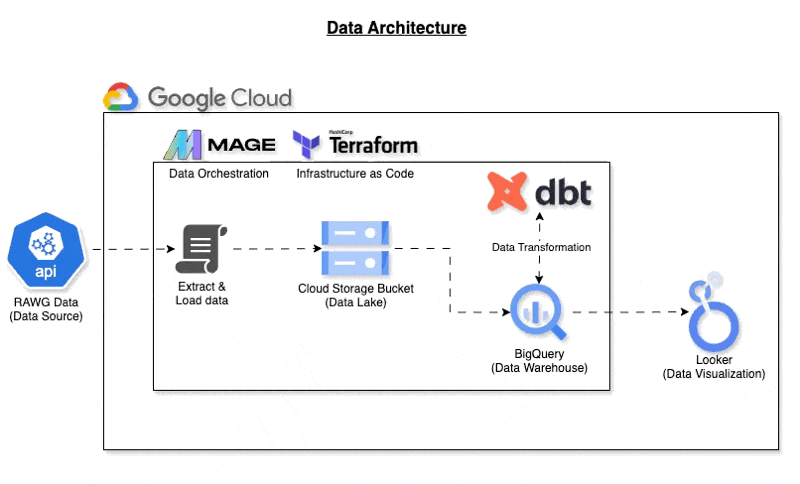

# Video Game Analysis

## Overview
This project aims to analyze video game data to identify trends and insights. The data is extracted from [RAWG](https://rawg.io/apidocs) using Python and stored in Google Cloud Storage (GCP). The data is then transformed using dbt Cloud and Mage. The entire process is orchestrated using Mage.

## Data Source
Data is extracted from the RAWG Video Games Database API. The API provides information on video games, including game title, genre, platform, release date, and more. The API documentation can be found [here](https://api.rawg.io/docs/#tag/games).

For the data dictionary, refer to the dbt documentation (Click `Sources`) [here](https://alangan17.github.io/video-game-analysis)

## Data Architecture


### Data Extraction and Load (Batch Ingestion)
1. Python Script using Mage

2. [Google Cloud Storage (GCP)](https://console.cloud.google.com/storage)

### Data Transformation
1. [dbt Core](https://github.com/dbt-labs/dbt-core)

### Data Warehouse
1. [Google BigQuery](https://cloud.google.com/bigquery)

### Data Visualization
1. [Google Looker Studio](https://datastudio.google.com/)

### Data Orchestration
1. [Mage](https://www.mage.ai/)

### Infrastructure as Code
1. [Terraform](https://www.terraform.io/)

### CI/CD
1. GitHub Actions - to generate and host dbt documentation
   

## Data Product
1. End to end pipeline to extract, transform, and load video game data
   

   

2. [dbt docs](https://alangan17.github.io/video-game-analysis) to view the data model and documentation
   

3. [Dashboard using Looker Studio](https://lookerstudio.google.com/reporting/787f3d23-cd50-4521-8d24-1398ea9138af/page/tEnnC)
   

## Setup

1. Fork this repository
2. [Create a codespace using the forked repository](https://docs.github.com/en/codespaces/developing-in-a-codespace/creating-a-codespace-for-a-repository#creating-a-codespace-for-a-repository)

### Google Cloud Setup
3. Create a Google Cloud account and project.
4. Install Terraform
5. In Google Cloud Storage, create 2 buckets (one for historical data and one for the latest data).
6. Create a service account. Required access:
   1. Storage Admin
   2. BigQuery Admin
7. Download the service account key and save it as `./keys/gcp-creds.json`
    > [!IMPORTANT]
    > Do not commit the service account key to the repository.


### Compute Environment Setup
8. Install Terraform (follow the instructions [here](https://developer.hashicorp.com/terraform/install?product_intent=terraform)
9. Run the following commands to set up the GCP environment:
```bash

terraform init
terraform plan
terraform apply

```
10. Prepare config files and create directories:
```bash
bash script/00_repo_initial_setup.sh
```

11. Prepare the files .env

12. Start the docker containers:
```bash
docker-compose up -d
```

13. Open the mage application
    

14. Run the pipeline `end_to_end_pipeline`
    

15. Check the data in BigQuery
16. Clone the [dashboard](https://lookerstudio.google.com/reporting/787f3d23-cd50-4521-8d24-1398ea9138af/page/tEnnC) in Looker Studio and connect the data source to BigQuery