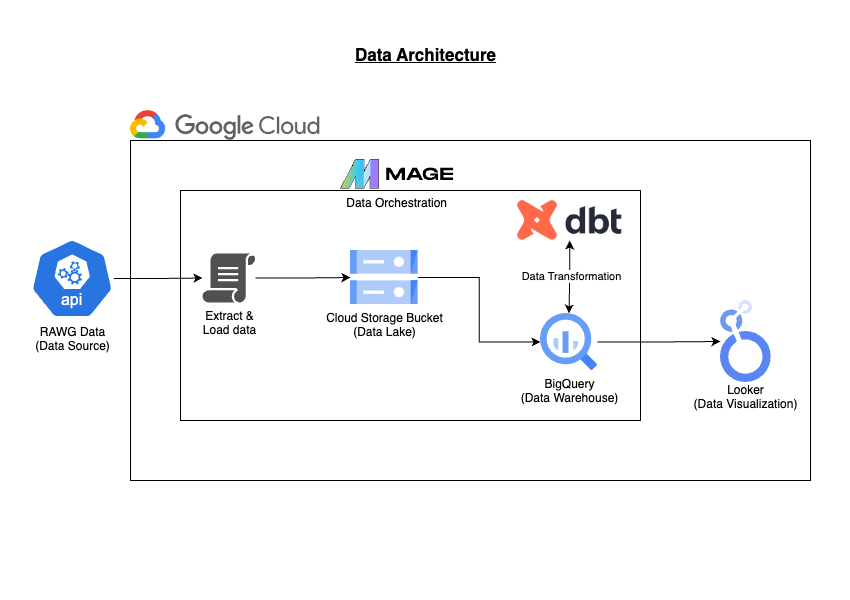

# Video Game Analysis

## Overview
This project aims to analyze video game data to identify trends and insights. The data is extracted from Mage and stored in Google Cloud Storage (GCP). The data is then transformed using dbt Cloud and Mage. The entire process is orchestrated using Mage.

## Data Source
Data is extracted from the RAWG Video Games Database API. The API provides information on video games, including game title, genre, platform, release date, and more. The API documentation can be found [here](https://api.rawg.io/docs/#tag/games).

For the data dictionary, refer to the dbt documentation [here](TBA)

## Data Architecture


### Data Extraction and Load (Batch Ingestion)
1. Python Script in Mage Pipeline
2. [Google Cloud Storage (GCP)](https://console.cloud.google.com/storage)

### Data Transformation
1. [dbt Core](https://github.com/dbt-labs/dbt-core)

### Data Warehouse
1. [Google BigQuery](https://cloud.google.com/bigquery)

### Data Visualization
1. [Google Looker Studio](https://datastudio.google.com/)

### Data Orchestration
1. [Mage](https://www.mage.ai/)

## Setup

### Google Cloud Setup
1. Create a Google Cloud account and project.
2. Install Terraform
3. In Google Cloud Storage, create 2 buckets (one for historical data and one for the latest data).
4. Create a service account. Required access:
   1. Storage Admin
   2. BigQuery Admin
5. Download the service account key and save it as `./keys/gcp-creds.json`
    > [!IMPORTANT]
    > Do not commit the service account key to the repository.


### Compute Environment Setup
1. Prepare config files and create directories:
```bash
bash script/00_repo_initial_setup.sh
```

2. Prepare the files .env

3. Start the docker containers:
```bash
docker-compose up -d
```